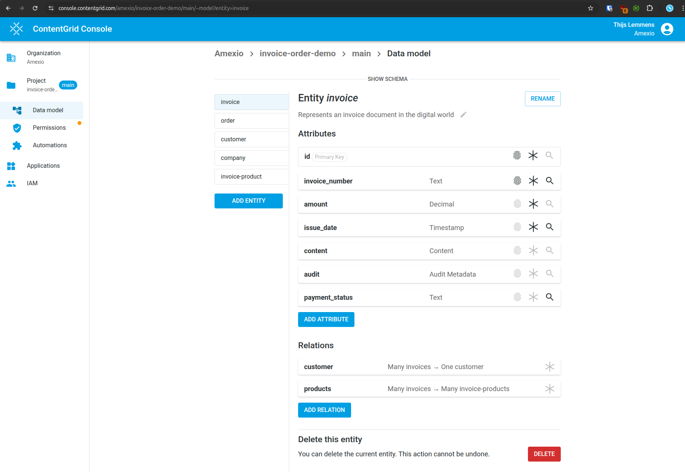
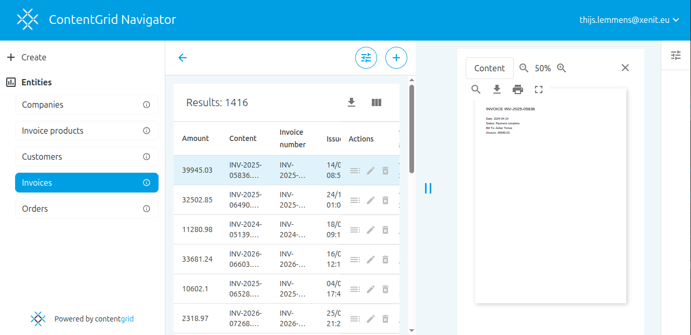

<!-- _class: title -->

<style scoped>
.pgug-logo { position: absolute; top: 28px; left: 48px; height: 64px; width: auto; }
</style>


# Scaling Semantic Models

## Bespoke PostgreSQL Schemas at SaaS Scale

Thijs Lemmens · March 2026

---

# About Xenit & Amexio Group

<style scoped>
.about-grid { display: grid; grid-template-columns: 1fr 1fr; gap: 2em; margin-top: 1em; }
.company-block { background: #f5f8fc; border-radius: 8px; padding: 1em 1.2em; border-top: 4px solid #019ee3; }
.company-block.amexio { border-top-color: #0e7c6b; }
.company-logo { height: 40px; width: auto; margin-bottom: 0.6em; display: block; }
.company-block h3 { font-size: 0.85em; color: #084772; margin: 0 0 0.4em; }
.company-block p { font-size: 0.7em; color: #374151; margin: 0; line-height: 1.5; }
.acq-banner { margin-top: 1.4em; background: #e8f4f0; border-left: 4px solid #0e7c6b; border-radius: 4px; padding: 0.6em 1em; font-size: 0.68em; color: #0e4a3a; }
</style>

<div class="about-grid">
<div class="company-block">


<h3>Alfresco ECM Service Provider</h3>
<p>Long-time Alfresco implementation partner — now building and offering ContentGrid as our own cloud-native ECM product.</p>

</div>
<div class="company-block amexio">


<h3>European Digital Solutions Group</h3>
<p>Pan-European group specialising in ECM, digital transformation, and intelligent information management.</p>

</div>
</div>

<div class="acq-banner">Xenit was acquired by Amexio Group in April 2025 — bringing ContentGrid into a broader portfolio of ECM expertise across Europe.</div>

---

# Agenda

1. The problem with EAV / generic data models
2. Model-driven schema generation
3. Runtime platform & row-level security
4. Conclusions

---

<!-- _class: section -->

# The Problem

## Why generic EAV tables fall short

---

# The EAV Trap

## How most CMS platforms store content

<div class="columns">
<div>

### Generic EAV schema

```sql
CREATE TABLE alf_node (
  id      bigint PRIMARY KEY,
  type_qname_id bigint REFERENCES alf_qname
);
CREATE TABLE alf_qname (
  id        bigint PRIMARY KEY,
  local_name varchar(200)
);
CREATE TABLE alf_node_properties (
  node_id       bigint REFERENCES alf_node,
  qname_id      bigint REFERENCES alf_qname,
  string_value  varchar(1024),
  boolean_value bit,
  int_value     int8,
  double_value  float8,
  ...
);
```

</div>
<div>

### What you actually want

```sql
CREATE TABLE articles (
  id           uuid PRIMARY KEY,
  title        text        NOT NULL,
  published_at timestamptz,
  word_count   integer,
  author_id    uuid REFERENCES authors
);
```

</div>
</div>

---

# One Document in EAV

## Storing a single article takes rows across 3 tables

<style scoped>
.eav-layout { display: flex; flex-direction: column; gap: 10px; margin-top: 4px; }
.eav-top { display: flex; gap: 14px; }
.eav-small { flex: 1; }
.eav-small table { width: 100%; border-collapse: collapse; font-size: 0.62em; font-family: monospace; background: #f5f8fc; color: #1a2b3c; border-radius: 6px; overflow: hidden; border: 1px solid #d0e4f0; }
.eav-small th { background: #e2eef7; color: #084772; padding: 5px 8px; text-align: left; font-size: 0.9em; letter-spacing: 0.04em; text-transform: uppercase; }
.eav-small td { padding: 4px 8px; border-top: 1px solid #d0e4f0; }
.eav-small caption { color: #5a7a95; font-size: 0.85em; font-style: italic; text-align: left; padding-bottom: 3px; font-family: monospace; }
.eav-props table { width: 100%; border-collapse: collapse; font-size: 0.61em; font-family: monospace; background: #f5f8fc; color: #1a2b3c; border-radius: 6px; overflow: hidden; border: 1px solid #d0e4f0; }
.eav-props th { background: #e2eef7; color: #084772; padding: 6px 10px; text-align: left; font-size: 0.9em; letter-spacing: 0.04em; text-transform: uppercase; border-bottom: 2px solid #d0e4f0; }
.eav-props td { padding: 5px 10px; border-top: 1px solid #d0e4f0; }
.eav-props td.null-val { color: #94a3b8; font-style: italic; }
.eav-props td.has-val { color: #0f5c30; font-weight: 600; }
.eav-props caption { color: #084772; font-size: 0.9em; font-style: italic; text-align: left; padding-bottom: 4px; font-family: monospace; font-weight: 700; }
.callout-dark { background: #7f1d1d; color: #fecaca; border-radius: 6px; padding: 8px 16px; font-size: 0.68em; font-weight: 600; margin-top: 6px; text-align: center; letter-spacing: 0.01em; }
</style>

<div class="eav-layout">
<div class="eav-top">
<div class="eav-small">
<table>
<caption>alf_node — 1 row</caption>
<thead><tr><th>id</th><th>type_qname_id</th></tr></thead>
<tbody><tr><td>42</td><td>7</td></tr></tbody>
</table>
</div>
<div class="eav-small">
<table>
<caption>alf_qname — excerpt</caption>
<thead><tr><th>id</th><th>local_name</th></tr></thead>
<tbody>
<tr><td>1</td><td>title</td></tr>
<tr><td>2</td><td>published_at</td></tr>
<tr><td>3</td><td>word_count</td></tr>
<tr><td>4</td><td>author_id</td></tr>
<tr><td>7</td><td>article</td></tr>
</tbody>
</table>
</div>
</div>
<div class="eav-props">
<table>
<caption>alf_node_properties — 4 rows (the actual values)</caption>
<thead><tr><th>node_id</th><th>qname_id</th><th>string_value</th><th>boolean_value</th><th>int_value</th><th>double_value</th></tr></thead>
<tbody>
<tr><td>42</td><td>1</td><td class="has-val">Getting Started with PostgreSQL</td><td class="null-val">NULL</td><td class="null-val">NULL</td><td class="null-val">NULL</td></tr>
<tr><td>42</td><td>2</td><td class="has-val">2024-03-15T09:00:00Z</td><td class="null-val">NULL</td><td class="null-val">NULL</td><td class="null-val">NULL</td></tr>
<tr><td>42</td><td>3</td><td class="null-val">NULL</td><td class="null-val">NULL</td><td class="has-val">1842</td><td class="null-val">NULL</td></tr>
<tr><td>42</td><td>4</td><td class="has-val">usr_abc123</td><td class="null-val">NULL</td><td class="null-val">NULL</td><td class="null-val">NULL</td></tr>
</tbody>
</table>
</div>
<div class="callout-dark">4 attribute rows &nbsp;·&nbsp; 6 typed columns &nbsp;·&nbsp; 20 NULL cells — to store one document</div>
</div>

---

# Same Document, Bespoke Table

## One row. Every column typed and named.

<style scoped>
.bespoke-wrap { margin-top: 14px; }
.bespoke-wrap table { width: 100%; border-collapse: collapse; font-size: 0.7em; font-family: monospace; background: #f5f8fc; border-radius: 8px; overflow: hidden; border-top: 4px solid #16a34a; }
.bespoke-wrap th { background: #e8f5e9; color: #14532d; padding: 9px 14px; text-align: left; font-size: 0.88em; letter-spacing: 0.03em; border-bottom: 2px solid #bbf7d0; }
.bespoke-wrap td { padding: 10px 14px; color: #1a2b3c; border-top: 1px solid #d1fae5; font-weight: 500; }
.bespoke-wrap caption { color: #14532d; font-size: 0.85em; font-style: italic; text-align: left; padding-bottom: 6px; font-family: monospace; font-weight: 700; }
.type-pill { display: inline-block; background: #d1fae5; color: #065f46; border-radius: 99px; font-size: 0.72em; font-weight: 700; padding: 1px 8px; margin-left: 6px; font-family: monospace; vertical-align: middle; }
.callout-green { background: #14532d; color: #dcfce7; border-radius: 6px; padding: 10px 18px; font-size: 0.72em; font-weight: 600; margin-top: 18px; text-align: center; letter-spacing: 0.01em; }
</style>

<div class="bespoke-wrap">
<table>
<caption>articles — 1 row</caption>
<thead><tr>
  <th>id <span class="type-pill">uuid</span></th>
  <th>title <span class="type-pill">text</span></th>
  <th>published_at <span class="type-pill">timestamptz</span></th>
  <th>word_count <span class="type-pill">integer</span></th>
  <th>author_id <span class="type-pill">uuid</span></th>
</tr></thead>
<tbody>
<tr>
  <td>42</td>
  <td>Getting Started with PostgreSQL</td>
  <td>2024-03-15 09:00:00+00</td>
  <td>1842</td>
  <td>usr_abc123</td>
</tr>
</tbody>
</table>
<div class="callout-green">1 row &nbsp;·&nbsp; 0 NULLs &nbsp;·&nbsp; every value in the right type</div>
</div>

---

# EAV: The Hidden Costs (1/2)

## Data integrity

| Concern               | EAV                                                  | Native schema               |
| --------------------- | ---------------------------------------------------- | --------------------------- |
| Type safety           | One column per type; wrong column = silent data loss | Enforced by the column type |
| Constraints           | `NOT NULL`, `UNIQUE` cannot be expressed             | Declarative, DB-enforced    |
| Referential integrity | Application-enforced                                 | Foreign keys                |

---

# EAV: The Hidden Costs (2/2)

## Performance & tooling

<style scoped>
section { font-size: 20px; }
</style>

| Concern               | EAV                                                                                                    | Native schema                  |
| --------------------- | ------------------------------------------------------------------------------------------------------ | ------------------------------ |
| Query complexity      | Reconstruct one node via dozens of `JOIN`s                                                             | Plain `SELECT`                 |
| Query planning        | Value-column statistics mix all property types — per-attribute selectivity is invisible to the planner | Accurate per-column statistics |
| Index efficiency      | Index on `(qname_id, string_value)` covers all attributes                                              | Targeted per-column indexes    |
| Tooling compatibility | Breaks ORMs, analytics tools                                                                           | Works out of the box           |
| Search performance     | Sync to Solr/Elasticsearch — operational heavy, denormalizes relations, eventual consistency   | Native full-text search, joins, transactional consistency |

> EAV trades correctness and performance for schema flexibility — but you can have both.

---

# How Bad Is It? A Real Migration

<div class="columns">
<div>

### The scenario

- **250 million** documents
- **60 attributes** each
- EAV model on Oracle

</div>
<div>

### How large is the Oracle database?

| | |
|---|---|
| **A** | < 500 GB |
| **B** | 500 GB – 2 TB |
| **C** | 2 TB – 5 TB |
| **D** | > 5 TB |

</div>
</div>

---

<!-- _class: dark -->

# The EAV Oracle database: **6 TB**

- 15 billion property rows, each with 6+ typed value columns
- Indexes on `(qname_id, *_value)` for every attribute type

> Now — same data, native PostgreSQL schema. Your guess?

---

# Same Data, Native PostgreSQL Schema

<div class="columns">
<div>

### What changes

- One row per document
- Typed columns — no attribute explosion
- No Oracle overhead

</div>
<div>

### How large is the PostgreSQL database?

| | |
|---|---|
| **A** | Still ~6 TB |
| **B** | 1 TB – 3 TB |
| **C** | 250 GB – 1 TB |
| **D** | < 250 GB |

</div>
</div>

---

<!-- _class: dark -->

# The ContentGrid database: **~300 GB**

- 250M rows of typed data
- Targeted indexes
- No attribute row explosion

<div class="highlight">

**20× smaller — by fixing the data model**

</div>

---

# Storage at a Glance

<style scoped>
.chart-wrap { display: flex; align-items: flex-end; justify-content: center; gap: 100px; height: 320px; margin-top: 60px; }
.bar-group { display: flex; flex-direction: column; align-items: center; justify-content: flex-end; gap: 8px; }
.bar-value { font-weight: 700; font-size: 22px; color: #084772; }
.bar { border-radius: 6px 6px 0 0; width: 160px; }
.bar-oracle { background: #ff0000; height: 200px; }
.bar-pg { background: #1db41d; height: 10px; }
.bar-label { font-size: 17px; font-weight: 600; color: #084772; text-align: center; line-height: 1.3; margin-top: 10px; }
.badge { background: #084772; color: #fff; border-radius: 20px; font-size: 14px; font-weight: 700; padding: 2px 12px; margin-top: 4px; display: inline-block; }
</style>

<div class="chart-wrap">
  <div class="bar-group">
    <div class="bar-value">6 TB</div>
    <div class="bar bar-oracle"></div>
    <div class="bar-label">Alfresco / Oracle<br><span class="badge">EAV</span></div>
  </div>
  <div class="bar-group">
    <div class="bar-value">~300 GB</div>
    <div class="bar bar-pg"></div>
    <div class="bar-label">ContentGrid / PostgreSQL<br><span class="badge">Native schema</span></div>
  </div>
</div>

---

<!-- _class: section -->

# Our Approach

## Generating native schemas from semantic models

---

# Two Platforms
## One to define the model. One to run it.

<style scoped>
.platform-card { border-top: 4px solid #019ee3; border-radius: 7px; background: #f5f8fc; padding: 14px 12px 10px; }
.platform-card.runtime { border-top-color: #0e7c6b; }
.platform-label { font-size: 0.62em; font-weight: 700; letter-spacing: 0.06em; text-transform: uppercase; color: #084772; margin-bottom: 8px; }
.platform-card img { width: 100%; border-radius: 5px; border: 1px solid #d0e4f0; display: block; }
.platform-caption { font-size: 0.58em; color: #5a7a95; margin-top: 7px; font-style: italic; }
</style>

<div class="columns">
<div>

<div class="platform-card">
<div class="platform-label">Management Platform</div>



<div class="platform-caption">ContentGrid Console — define entities, attributes, permissions</div>
</div>

</div>
<div>

<div class="platform-card runtime">
<div class="platform-label">Runtime Platform</div>



<div class="platform-caption">ContentGrid Navigator — end-user app, driven by the model</div>
</div>

</div>
</div>

---

# The Management Platform

<style scoped>
.flow { display: flex; align-items: stretch; gap: 0; margin: 28px 0 20px; }
.comp { background: #f5f8fc; border: 2px solid #d0e4f0; border-top: 4px solid #019ee3; border-radius: 8px; padding: 18px 16px; flex: 1; }
.comp h3 { color: #084772; margin: 0 0 6px 0; font-size: 0.95em; letter-spacing: 0.02em; }
.comp p { margin: 0; font-size: 0.72em; color: #5a7a95; line-height: 1.4; }
.arr { display: flex; align-items: center; padding: 0 10px; color: #019ee3; font-size: 1.6em; font-weight: 300; }
.tagline { background: #019ee3; color: #fff; border-radius: 8px; padding: 14px 24px; text-align: center; font-size: 0.88em; font-weight: 600; letter-spacing: 0.01em; }
</style>

<div class="flow">
  <div class="comp"><h3>Architect</h3><p>Source of truth for the domain model — entities, attributes, relations</p></div>
  <div class="arr">→</div>
  <div class="comp"><h3>Scribe</h3><p>Compiles model changes into:<br />
      &#x2022; JSON model<br />
      &#x2022; Flyway SQL migrations<br />
      &#x2022; OPA policies</p></div>
  <div class="arr">→</div>
  <div class="comp"><h3>Captain</h3><p>
  &#x2022; Provisions database <br />
  &#x2022; manages credentials <br />
  &#x2022; deployment</p></div>
</div>

<div class="tagline">Every model change → versioned, reviewed SQL migration &nbsp;·&nbsp; Schema always reflects the model — no manual DDL</div>

---


# Model-Driven Schema Generation

<style scoped>
pre { font-size: 15px; }
</style>

<div class="columns">
<div>

### User-defined semantic model

```json
{
  "name": "article",
  "table": "article",
  "attributes": [
    {
      "type": "simple",
      "name": "title",
      "dataType": "text",
      "columnName": "title",
      "constraints": [{ "type": "required" }]
    },
    {
      "type": "simple",
      "name": "publishedAt",
      "dataType": "datetime",
      "columnName": "published_at"
    },
    {
      "type": "simple",
      "name": "wordCount",
      "dataType": "long",
      "columnName": "word_count"
    }
  ],
  ...
}
```

</div>
<div>

### Generated PostgreSQL DDL

```sql
CREATE TABLE article (
  id           uuid PRIMARY KEY
                 DEFAULT gen_random_uuid(),
  title        text NOT NULL,
  published_at timestamptz,
  word_count   bigint
);
```

</div>
</div>

---

# The Runtime Platform

## How a request flows from client to database

<style scoped>
.rt { display: flex; flex-direction: column; gap: 0; margin-top: 18px; }
.rt-row  { display: flex; align-items: stretch; }
.rt-conn { display: flex; align-items: center; height: 36px; }
.n { flex: 1 1 0; min-width: 0; background: #f5f8fc; border: 1.5px solid #d0e4f0; border-top: 4px solid #019ee3; border-radius: 7px; padding: 10px 8px; text-align: center; }
.n.teal  { border-top-color: #0e7c6b; }
.n.amber { border-top-color: #d97706; }
.n.navy  { border-top-color: #084772; }
.n h4 { margin: 0 0 4px; font-size: 0.82em; color: #084772; font-weight: 700; }
.n p  { margin: 0; font-size: 0.6em; color: #5a7a95; line-height: 1.35; }
.a { flex: 0 0 54px; display: flex; flex-direction: column; align-items: center; justify-content: center; gap: 1px; }
.a .lbl { font-size: 0.46em; color: #64748b; text-align: center; line-height: 1.25; }
.a .sym { font-size: 1.1em; color: #019ee3; line-height: 1; }
.g { flex: 0 0 54px; }
.v { flex: 1 1 0; min-width: 0; display: flex; justify-content: center; align-items: center; color: #94a3b8; font-size: 1.3em; }
.e { flex: 1 1 0; min-width: 0; }
.callout { background: #084772; color: #fff; border-radius: 6px; padding: 8px 16px; font-size: 0.68em; font-weight: 600; margin-top: 12px; text-align: center; }
</style>

<div class="rt">
  <div class="rt-row">
    <div class="n"><h4>Client</h4><p>browser · API consumer</p></div>
    <div class="a"><span class="lbl">① + JWT</span><span class="sym">▶</span></div>
    <div class="n"><h4>Gateway</h4><p>entry point · routing · CORS</p></div>
    <div class="a"><span class="lbl">④ residual JWT</span><span class="sym">▶</span></div>
    <div class="n"><h4>App Server</h4><p>model-driven REST · dynamic SQL</p></div>
    <div class="a"><span class="lbl">⑤ SQL + filter</span><span class="sym">▶</span></div>
    <div class="n navy"><h4>PostgreSQL</h4><p>bespoke schema · filtered rows</p></div>
  </div>
  <div class="rt-conn">
    <div class="v">↕</div>
    <div class="g"></div>
    <div class="v">↕</div>
    <div class="g"></div>
    <div class="e"></div>
    <div class="g"></div>
    <div class="e"></div>
  </div>
  <div class="rt-row">
    <div class="n teal"><h4>Keycloak</h4><p>OIDC · issues JWT with user attributes</p></div>
    <div class="g"></div>
    <div class="n amber"><h4>OPA</h4><p>② policy query · ③ residual expression</p></div>
    <div class="g"></div>
    <div class="e"></div>
    <div class="g"></div>
    <div class="e"></div>
  </div>
  <div class="callout">Gateway encodes OPA's residual as a JWT claim — App Server applies it as a SQL <code>WHERE</code> filter</div>
</div>

---

# Partial Evaluation: The Key Insight

<style scoped>
.comparison { display: flex; gap: 2rem; margin: 1.2rem 0; }
.col { flex: 1; background: #f5f8fc; border-radius: 6px; padding: 1rem 1.2rem; }
.col.bad { border-top: 4px solid #c0392b; }
.col.good { border-top: 4px solid #019ee3; }
.col h3 { margin: 0 0 0.6rem; font-size: 0.9em; color: #1a2b3c; }
.col pre { font-size: 0.62em; margin: 0.4rem 0; background: #fff; border: 1px solid #d0e4f0; border-radius: 4px; padding: 0.5rem; color: #1a2b3c; }
.col .note { font-size: 0.68em; color: #1a2b3c; font-weight: 600; margin-top: 0.6rem; }
.highlight { background: #084772; color: #fff; border-radius: 6px; padding: 0.6rem 1rem; font-size: 0.78em; font-weight: 600; margin-top: 1rem; text-align: center; }
</style>

<div class="comparison">
<div class="col bad">

### Naïve approach

```
for each row in invoices:     ← full table scan
  if OPA.check(row, user):    ← N network calls
    return row
```

<div class="note">N rows fetched, N OPA calls, unauthorized data in memory</div>

</div>
<div class="col good">

### Partial evaluation

```
OPA.partial_eval(policy, user)  ← 1 call, no entity data
    → residual: dept='sales'
      OR status='published'

SELECT * FROM invoices
WHERE dept='sales'
  OR status='published'          ← filtered at the DB
```

<div class="note">1 OPA call, unauthorized rows never leave PostgreSQL</div>

</div>
</div>

<div class="highlight">The security boundary is enforced inside the database — not in application memory</div>

---

# From Policy Rule to SQL Filter

<style scoped>
.steps { display: flex; flex-direction: column; gap: 0.4rem; margin: 0.5rem 0; }
.row { display: grid; grid-template-columns: 13rem 1fr; align-items: center; background: #f5f8fc; border-left: 4px solid #019ee3; border-radius: 6px; padding: 0.5rem 1rem; gap: 1rem; }
.row-label { color: #084772; font-weight: 700; font-size: 0.8em; white-space: nowrap; }
.row pre { margin: 0; font-size: 0.72em; background: #fff; border: 1px solid #d0e4f0; border-radius: 4px; padding: 0.4rem 0.75rem; color: #1a2b3c; }
.note { font-size: 0.65em; color: #5a7a95; margin-top: 0.4rem; font-style: italic; }
.highlight-light { background: #084772; color: #fff; border-radius: 6px; padding: 0.55rem 1rem; font-size: 0.78em; font-weight: 600; margin-top: 0.6rem; text-align: center; }
</style>

<div class="steps">
<div class="row">
<div class="row-label">① Policy condition</div>
<pre>entity.department == user.department
OR entity.status == "published"</pre>
</div>
<div class="row">
<div class="row-label">② OPA partial eval</div>
<pre>OPA.partial_eval(policy, user)
  → dept == user.dept  OR  status == "published"</pre>
</div>
<div class="row">
<div class="row-label">③ SQL WHERE (JOOQ)</div>
<pre>SELECT * FROM invoices
WHERE department = 'sales' OR status = 'published'</pre>
</div>
</div>

<div class="note">Defined in Architect UI → compiled to Rego by Scribe → evaluated by OPA (1 call, result in Gateway JWT) → App Server builds JOOQ predicate</div>
<div class="highlight-light">Unauthorized rows never leave the database — the filter runs inside PostgreSQL</div>

---

<!-- _class: dark -->

# Conclusions

- EAV trades correctness & performance for flexibility — you can have both
- Native schemas: 20× smaller, full SQL tooling, real constraints
- ContentGrid generates & migrates schemas from a semantic model
- Security boundary enforced inside PostgreSQL via partial evaluation

---

<!-- _class: center -->

# Questions?

**contentgrid.com**

---

<!-- _class: title -->

# Thank You

## Thijs Lemmens

thijs.lemmens@xenit.eu
